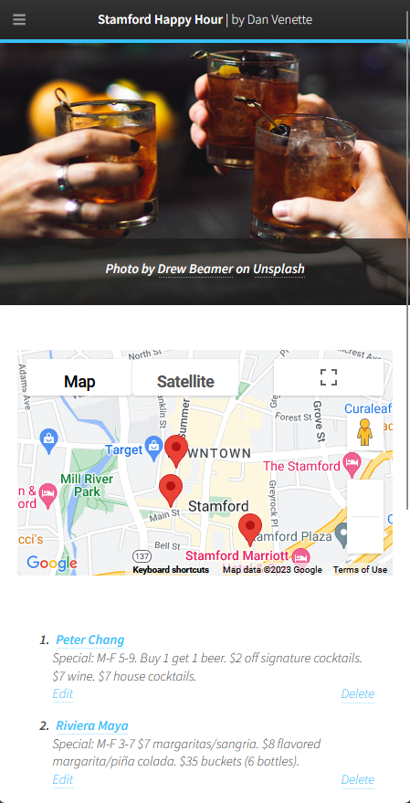
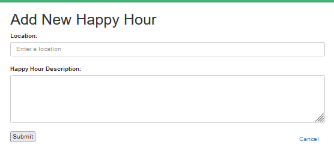

# Stamford Happy Hour Finder 🍻🗺️

Stamford Happy Hour Finder is a responsive website that helps users find happy hour deals in Stamford, Connecticut. It integrates the Google Maps API and a PostgreSQL database, and is built using the Flask framework and Bootstrap for responsive design.

Check out the live website at 👉 http://dancodes4376.pythonanywhere.com
## Features 🌟

    Search for happy hour deals by location, time, and day of the week 🔍🕒📅
    View happy hour details, including deal descriptions, prices, and hours 👀💰⏰
    See happy hour locations on a map 🗺️📍
    Add new happy hour deals to the database 🆕🍹
    Edit or delete existing happy hour deals ✏️🗑️

## Technologies Used 💻

    Flask
    PostgreSQL
    Google Maps API
    Bootstrap (for responsive design)
    
<!-- Bootstrap CSS -->
<link rel="stylesheet" href="https://maxcdn.bootstrapcdn.com/bootstrap/4.5.2/css/bootstrap.min.css">

<!-- Bootstrap JS -->

    

  

    

      
    

    

      
    

    

      
    

  

  <button class="carousel-control-prev" type="button" data-bs-target="#carouselExampleControls" data-bs-slide="prev">
    
    Previous
  </button>
  <button class="carousel-control-next" type="button" data-bs-target="#carouselExampleControls" data-bs-slide="next">
    
    Next
  </button>

